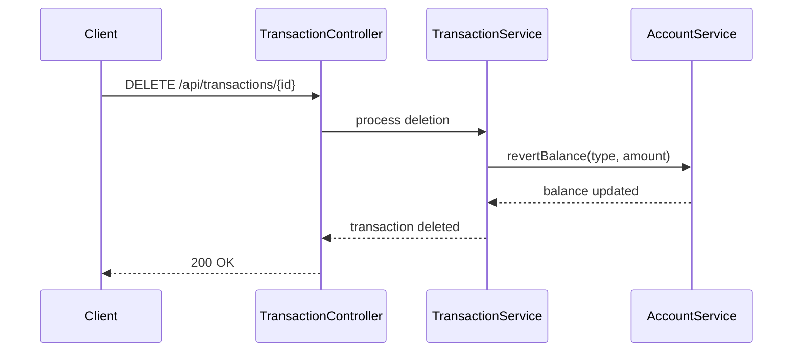
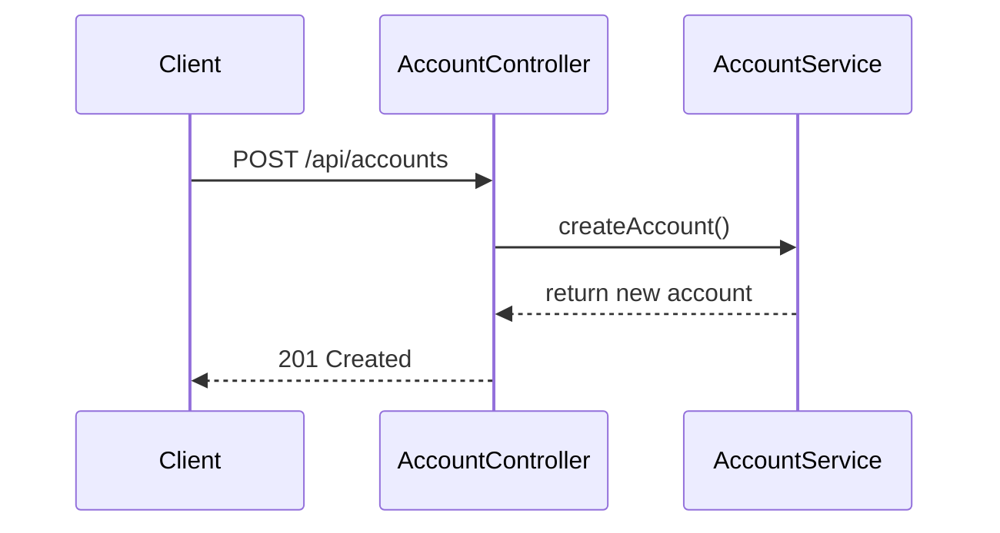

# backend-debit-credit-service
Basic CRUD APIs


# Mini Spring Boot Debit-Credit Project Documentation

This document contains:

* ✅ README for the project
* ✅ Sequence Diagrams (using Mermaid)
* ✅ Postman Collection (JSON export format)

---

# 📘 README

## **Project Name:** `debit-credit-service`

A minimal Spring Boot application that manages **accounts** and **transactions**, using **in-memory ArrayLists** instead of a database.

---

## ✅ **1. Overview**

This project provides simple CRUD operations for:

* **Accounts** (create, update, view, delete)
* **Transactions** (credit/debit entries)

All data is stored in **ArrayList objects**, initialized at application startup. No database, JPA, or SQL is used.

This project is ideal for:

* Practicing basic Spring Boot
* Testing controller/service separation
* Understanding debit-credit business rules
* Running fast without DB overhead

---

## ✅ **2. Features**

### **Accounts**

* Create account
* Get account details
* List all accounts
* Update account name
* Delete account
* Balance automatically updates when transactions are created/deleted/updated

### **Transactions**

* Create debit/credit
* Fetch by ID
* List all
* List by account
* Update transaction
* Delete transaction (revert balance)

---

## ✅ **3. Business Rules**

### **CREDIT**

* Adds amount to account balance

### **DEBIT**

* Subtracts amount
* Cannot result in negative balance → reject

### **On Update**

* Reverse old amount
* Apply new amount

### **On Delete**

* Reverse transaction effect

---

## ✅ **4. Tech Stack**

* Java 17+
* Spring Boot 3.x
* Spring Web
* Lombok

---

## ✅ **5. How To Run**

```
mvn spring-boot:run
```

OR

```
./mvnw spring-boot:run
```

All data resets on every restart.

---

## ✅ **6. API Endpoints**

Same as defined earlier (Accounts + Transactions CRUD).

---

# 📐 Sequence Diagrams

## ✅ **1. Create Transaction (Debit/Credit)**

```mermaid
dsequenceDiagram
    participant C as Client
    participant CT as TransactionController
    participant S as TransactionService
    participant A as AccountService

    C->>CT: POST /api/transactions
    CT->>S: validate + process
    S->>A: fetchAccount(accountId)
    A-->>S: account found
    S->>A: updateBalance(type, amount)
    A-->>S: balance updated
    S-->>CT: transaction saved
    CT-->>C: 201 Created
```

## ✅ **2. Delete Transaction**



## ✅ **3. Create Account**



---

# 📤 Postman Collection

```json
{
  "info": {
    "name": "Debit Credit Service Collection",
    "schema": "https://schema.getpostman.com/json/collection/v2.1.0/collection.json"
  },
  "item": [
    {
      "name": "Create Account",
      "request": {
        "method": "POST",
        "header": [{ "key": "Content-Type", "value": "application/json" }],
        "body": {
          "mode": "raw",
          "raw": "{\n  \"accountName\": \"Savings Account\"\n}"
        },
        "url": {
          "raw": "http://localhost:8080/api/accounts",
          "protocol": "http",
          "host": ["localhost"],
          "port": "8080",
          "path": ["api", "accounts"]
        }
      }
    },
    {
      "name": "Get All Accounts",
      "request": {
        "method": "GET",
        "url": {
          "raw": "http://localhost:8080/api/accounts",
          "protocol": "http",
          "host": ["localhost"],
          "port": "8080",
          "path": ["api", "accounts"]
        }
      }
    },
    {
      "name": "Create Transaction",
      "request": {
        "method": "POST",
        "header": [{ "key": "Content-Type", "value": "application/json" }],
        "body": {
          "mode": "raw",
          "raw": "{\n  \"accountId\": \"{{accountId}}\",\n  \"type\": \"DEBIT\",\n  \"amount\": 200,\n  \"description\": \"Test debit\"\n}"
        },
        "url": {
          "raw": "http://localhost:8080/api/transactions",
          "protocol": "http",
          "host": ["localhost"],
          "port": "8080",
          "path": ["api", "transactions"]
        }
      }
    },
    {
      "name": "Get All Transactions",
      "request": {
        "method": "GET",
        "url": {
          "raw": "http://localhost:8080/api/transactions",
          "protocol": "http",
          "host": ["localhost"],
          "port": "8080",
          "path": ["api", "transactions"]
        }
      }
    }
  ]
}
```

---

If you want, I can now:
✅ Generate the full Spring Boot project structure
✅ Provide Controllers, Services, Models using ArrayLists
✅ Add sample data on startup
✅ Create unit tests
Just tell me!
